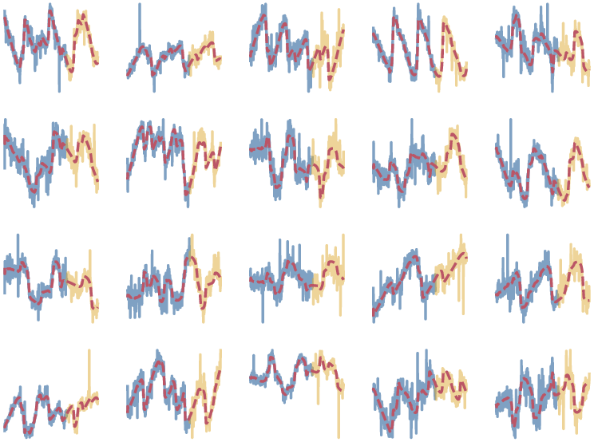

# Probabilistic Sequential Matrix Factorization

This repository contains the code to reproduce the experiments in:

[**Akyildiz, van den Burg, Damoulas, Steel - Probabilistic Sequential Matrix 
Factorization (2021)**](http://proceedings.mlr.press/v130/akyildiz21a.html)

Work that uses the methods described in the paper or the code in this 
repository should cite the paper, for instance using the following BibTeX 
entry:

```bib
@inproceedings{akyildiz2021probabilistic,
    title={Probabilistic Sequential Matrix Factorization},
    author={{\"O}mer Deniz Akyildiz and Gerrit J. J. {van den Burg} and Theodoros Damoulas and Mark F. J. Steel},
    booktitle={Proceedings of the 24th International Conference on Artificial Intelligence and Statistics},
    editor={Banerjee, Arindam and Fukumizu, Kenji},
    pages={3484--3492},
    volume={130},
    year={2021},
    series={Proceedings of Machine Learning Research},
    publisher={PMLR},
}
```

If you encounter a problem when using this repository or simply want to ask a 
question, please don't hesitate to [open an issue on 
GitHub](https://github.com/alan-turing-institute/rPSMF) or send an email to 
``odakyildiz at turing dot ac dot uk`` and/or ``gertjanvandenburg at gmail dot 
com``.

## Introduction

Our Probabilistic Sequential Matrix Factorization (PSMF) method allows you to 
model high-dimensional timeseries data that exhibits non-stationary dynamics. 
We also propose a robust variant of the model, called rPSMF, that handles 
model misspecification and outliers.

See [the paper](http://proceedings.mlr.press/v130/akyildiz21a.html) for 
further details.

<p align="center">
  
  <br>
  <br>
  <span><i>Illustration of using rPSMF to model a 20-dimensional time series 
  with non-linear dynamics and t-distributed outliers. Blue lines are the 
  observed data and yellow lines are unobserved future data. The red dashed 
  line shows the predictions from our model.
  </i></span>
</p>

## Usage

The code in this repository is organized by experiment. The 
[Convergence](./Convergence) directory contains the code for the convergence 
experiment in the appendix of the paper.

The accompanying Makefile can be used to reproduce the experiments by simply 
running

```bash
$ make ExperimentSynthetic   # or ExperimentBeijing, or ExperimentImpute, or ExperimentRecursive
```

These experiments will be run through a Python virtual environment that will 
be automatically created with the required dependencies. For the imputation 
experiment the results are captured in LaTeX tables that are automatically 
generated as well.

The code for the change point detection Experiment and the convergence 
experiment are written in Matlab, so require a Matlab installation to 
reproduce. See the readme files in the corresponding directories for more 
information.

## Notes

The code is licensed under the MIT license unless otherwise noted, see the 
[LICENSE](./LICENSE) file for further details.
